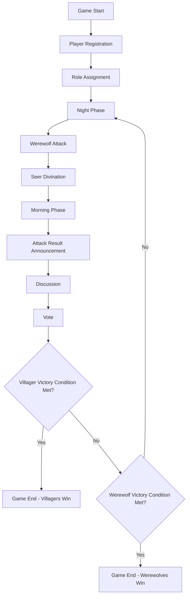

# Werewolf-cli

## Game Flow

```mermaid
flowchart TD
    A[Game Start] --> B[Player Registration]
    B --> C[Role Assignment]
    C --> D[Night Phase]
    D --> E[Werewolf Attack]
    E --> F[Seer Divination]
    F --> G[Morning Phase]
    G --> H[Attack Result Announcement]
    H --> I[Discussion]
    I --> J[Vote]
    J --> K{Villager Victory Condition Met?}
    K --> |Yes| L[Game End - Villagers Win]
    K --> |No| M{Werewolf Victory Condition Met?}
    M --> |Yes| N[Game End - Werewolves Win]
    M --> |No| D
```
